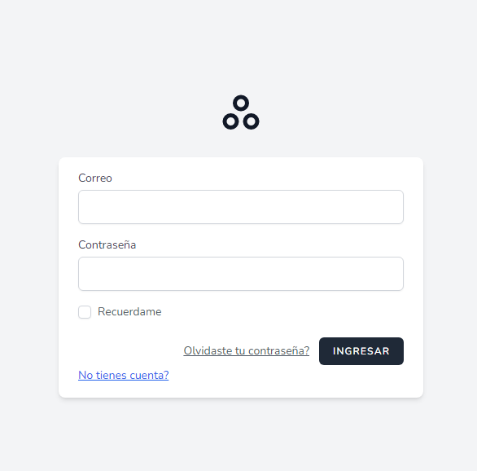
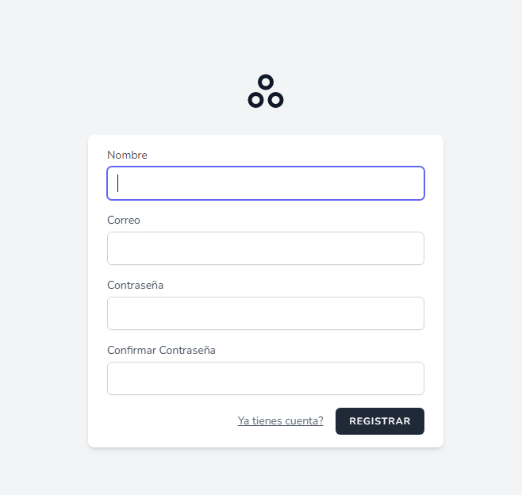
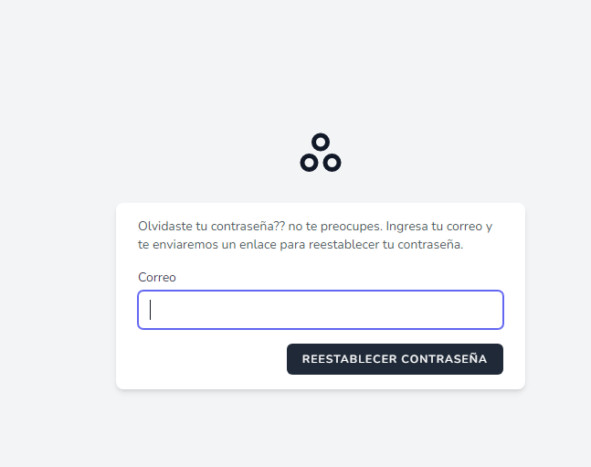
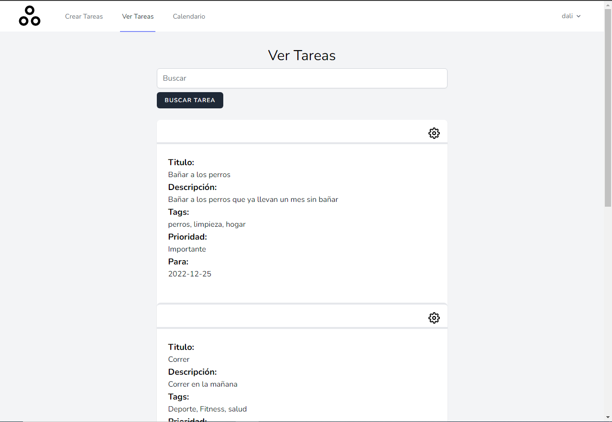
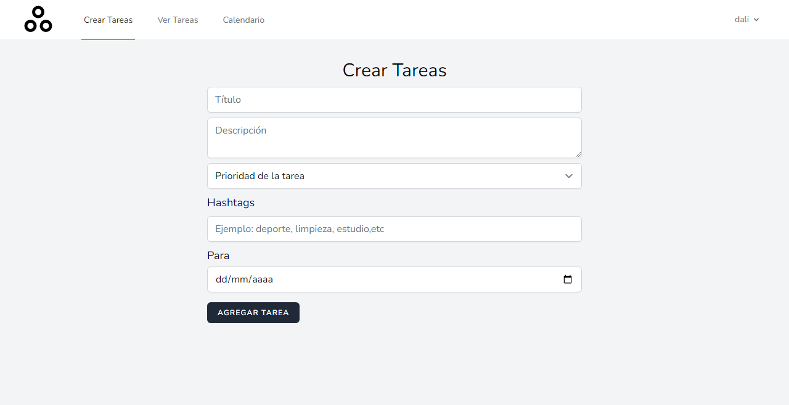
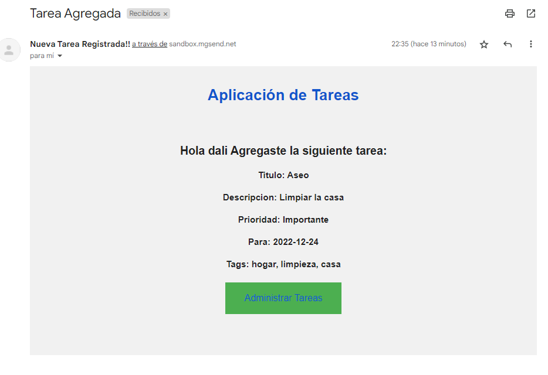
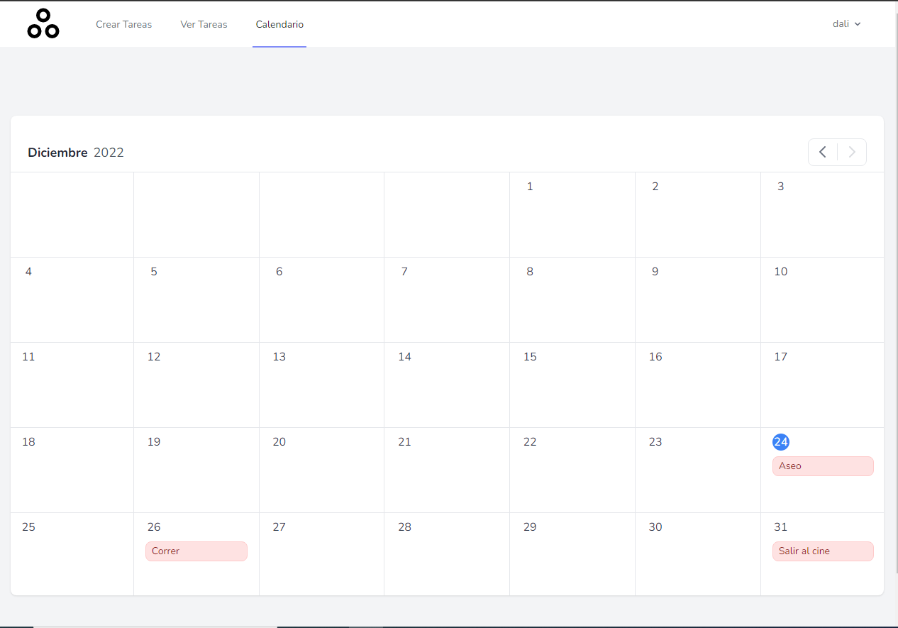

<h1 align="center">Gestión de Tareas</h1>

Gestión de tareas es una aplicación sencilla en donde puedes agregar, editar y ver las tareas creadas

<h1 align="center">Funcionalidades</h1>
<ul>
<li >Login 
 El login esta creado con el paquete de inicio <a href="https://laravel.com/docs/9.x/starter-kits#laravel-breeze" target="_blank">breeze</a>, el cual es proporcionado por <a href="https://laravel.com" target="_blank">laravel.</a> 
Se le agrego el enlace de "No tienes cuenta?" con el objetivo de permitir una facil creacion de usuario.
</li>
 
<li >Registro 

 
El registro esta creado con el paquete de inicio <a href="https://laravel.com/docs/9.x/starter-kits#laravel-breeze" target="_blank">breeze</a>, el cual es proporcionado por <a href="https://laravel.com" target="_blank">laravel.</a> Por lo que unicamente se cambio el logo por defecto al igual que la traduccion de elementos.
</li>
 
<li >Recuperar Contraseña 

 
Para poder usar la recuperacion de contraseña es necesario ingresar las credenciales necesarias en .env para motivos de prueba usamos <a href="https://www.mailgun.com/" target="_blank">Mailgun</a>, seleccionamos la opcion smtp e ingresamos las credenciales.
</li>
 
<li >Ver Tareas 

 
Al ingresar tendremos esta vista en la cual podremos ver las tareas que hemos agregado. Tendremos un buscador el cual podremos utilizar para encontrar las tareas de nuestro interes.
</li>
 
<li >Crear Tarea 

 
Aqui podremos crear las tareas, las cuales tendran un titulo, descripcion, tags, prioridad y fecha de realizacion.
 
Si añadimos nuestro servidor smtp y el recipiente seguro(en caso de usar mailgun en la version de prueba), nos llegaria el siguiente correo

</li>
 
<li >Editar Tareas 

 
Tanto en crear tarea como en ver tarea tendremos la opcion de editar la tarea seleccionada tanto como de borrarla.
</li>
 
<li >Calendario 

 
Tambien tendremos la opcion de ver un calendario, en donde nos marcara con un puntito azul la fecha actual y de color rojo la tarea en la fecha asignada.
</li>
 
</ul>

Esto seria todo espero les haya gustado este pequeño proyecto para administrar sus tareas si tienen alguna duda o sugerencia no duden en contactarse conmigo.

<h3>Es necesario crear una base de datos llamada tareas</h3>

<a href="https://gist.github.com/hootlex/da59b91c628a6688ceb1">Como correr laravel local</a>

